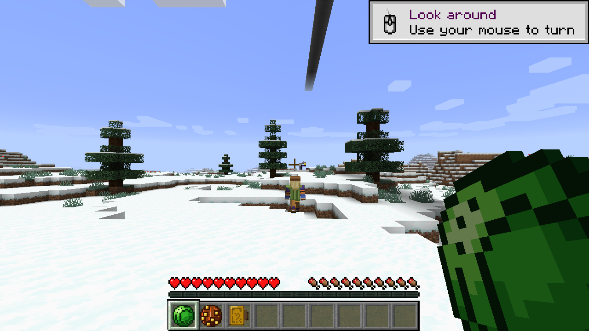
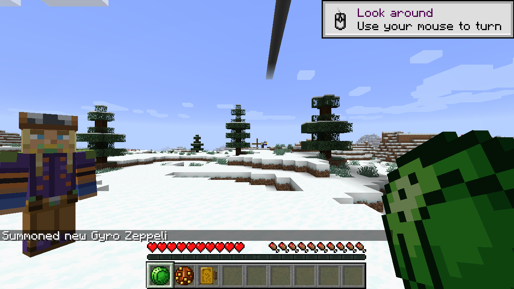
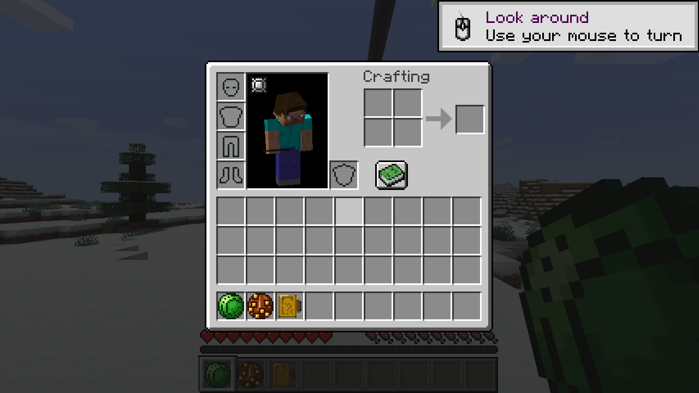
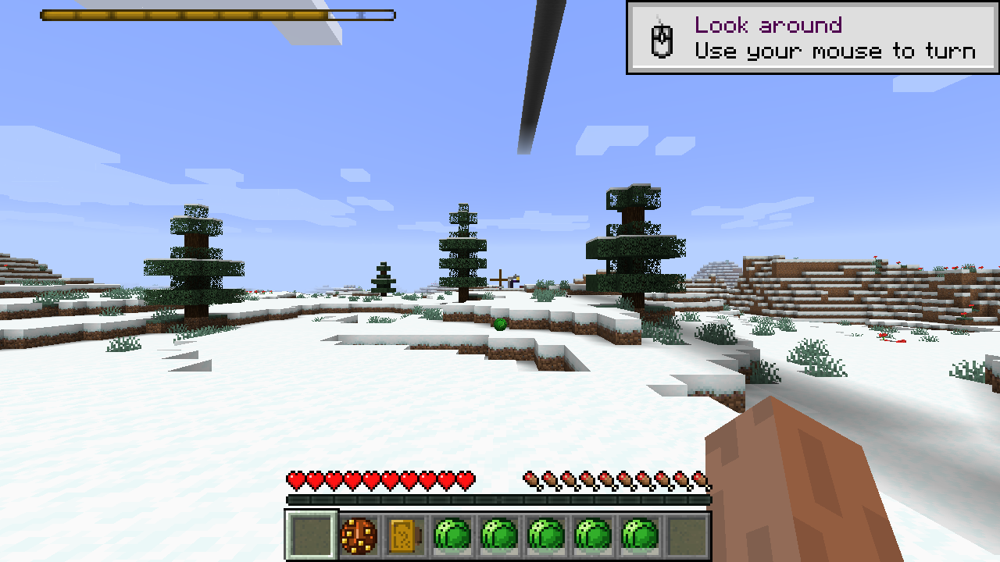
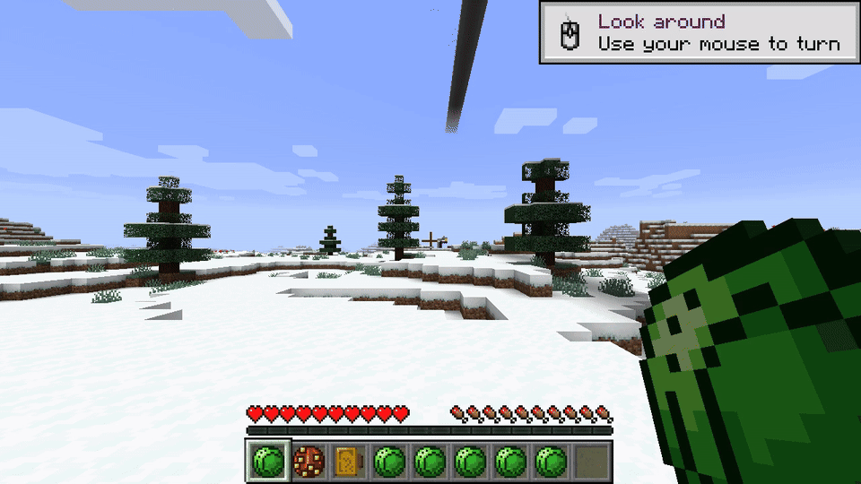
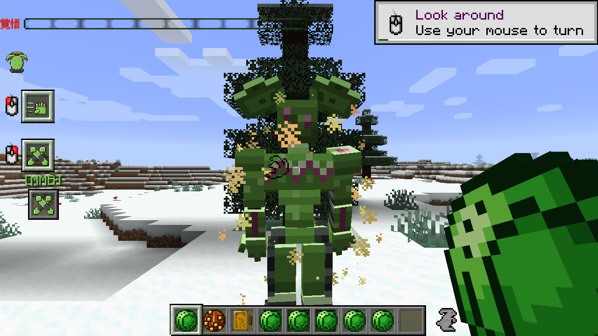

# RotP Spin Addon

> Steel Balls, the Golden Spin and Ball Breaker from JoJo Parts 7/8 — as kinetics, rotation and the Golden Ratio for [Ripples of the Past](https://github.com/StandoByte/Ripples-of-the-Past).

[](https://github.com/Loischsiy/Rotp-spin-addon/actions/workflows/build.yml)
[](LICENSE)




Spin is not magic here — it is geometry, biomechanics and rotation energy, the way the manga tells it.
You learn the five lessons of Gyro Zeppeli one by one, throw spinning Steel Balls that return to your hand,
frame the Golden Rectangle with your arms, gallop into the Super Spin — and, once, manifest **Ball Breaker**.

## Contents

- [Quick start](#quick-start)
- [Features](#features)
- [Screenshots](#screenshots)
- [Usage](#usage)
- [Configuration](#configuration)
- [Compatibility](#compatibility)
- [Contributing](#contributing)
- [License](#license)
- [Acknowledgements](#acknowledgements)

## Quick start

**Requirements:** Minecraft 1.16.5, Forge `36.2.34`, Java 8, Ripples of the Past
(`main_mod_version` in `gradle.properties`, currently `1.16.5-0.2.2-snapshot-250108-c`).

```bash
# Easiest: grab the jar from the latest GitHub Actions run (or Release) and drop it into mods/
mods/
├── jojo-1.16.5-....jar   # Ripples of the Past
└── RotP-Spin-1.0.jar      # this addon
```

Your first five minutes in game (cheats on):

```mcfunction
/jojopower give @p rotp_spin:spin
/give @p rotp_spin:steel_ball
/give @p rotp_spin:calibration_buckle
/summon rotp_spin:gyro_teacher ~3 ~ ~3
/spinlesson get @p
```

Throw the Steel Ball with the `Spin Ball Throw` action, catch it back, land hits —
that practice is what opens lesson 2.

> Building from source? See [Contributing](#contributing) — JDK 8 is mandatory.

## Features

**Throw, charge, strike, steer**

- `Spin Ball Throw` — a spinning Steel Ball that damages, ricochets and returns to the hand (or holster).
- `Spin Ball Charge` — wind the ball up in your hand before release: more velocity and damage, slowed while winding.
- `Spin Ball Strike` — a point-blank hit with the spinning ball held in hand.
- `Spin Ball Steer` — nudge a flying ball mid-flight toward your aim.
- Spin-up of ordinary items and blocks (`Spin Item/Block Throw`), with spin friction, rope tricks and sail gliding.

**Five lessons, earned by practice — ✅ canon progression**

| Lesson | Gyro's lesson | What opens it |
|---|---|---|
| 1 | “If there's a will — do it” | Spin on your own body: `Body Brace` leap, charge and strike |
| 2 | “Work your muscles” | `Muscle Hijack`: land ball hits to force a mob's action |
| 3 | “Believe in the rotation” | Hijack targets to unlock thrown item/block Spin |
| 4 | Golden Spin: frame the Golden Rectangle | `Golden Frame` + damage multiplier, barrier piercing |
| 5 | “The shortest path is the detour” | Super Spin without gallop; the road to ACT4/Ball Breaker |

**Golden Spin and Super Spin**

- Calibrate by the world: snowflakes and nature work as the Golden reference; dead biomes demand the `Calibration Buckle` (or your own hands).
- A healthy horse at its natural gallop generates infinite rotation energy through the stirrups — any interference breaks it.
- A **chipped** Steel Ball charges weaker and cannot hold the highest Spin. Repair it or accept the penalty.

**Wrecking Ball and Hemispatial Neglect**

- Guard's sphere with separating satellites that wound from unexpected angles.
- Even a miss sends a shockwave: victims lose everything on the **left** — dimmed left half of the screen for players, mobs can't track left, horses veer right.

**Ball Breaker — the visualization of Spin energy**

- Manifests from a gallop Super Spin throw — never from a Stand Arrow (`NON_ARROW` pool).
- Punch / heavy / block plus the touch of **senescence**: each touch deepens aging (max HP, speed and attack drain per stack), and the victim's Stand ages too.
- With the optional D4C addon, a Golden throw pierces Love Train and reaches its master.

**Gear and the teacher**

- `Steel Ball`, `Wrecking Ball`, `Gyro's Holster` (fast throw, catches returns), `Calibration Buckle`, `Gyro's Cloak` (spin sail).
- `Gyro Zeppeli` wandering teacher NPC (spawn egg `gyro_teacher_egg`) — the Neapolitan who can actually teach you.

## Screenshots

All shots taken headless in-game (`mcx`, Forge 1.16.5, llvmpipe) — no staging mods.

**Spin in hand, teacher at your side.** Snowy biome doubles as a Golden reference.


**Gyro Zeppeli up close** — purple coat, hat, blond hair. He spawns in the world and teaches the lessons.



**The kit** — Steel Ball, Wrecking Ball and Calibration Buckle in the inventory.



**Spin throw: release and return.** The ball leaves the hand (empty first slot, Spin energy bar drains top-left),
spins through the air — and comes back, because that is what rotation does.





**Ball Breaker in the flesh.** Green artificial humanoid with magenta core details,
black-banded limbs and a shower of gold sparks on the punch. In survival it manifests
from the gallop Super Spin throw — posed here via `/stand give` for the photo.



## Usage

**Learn and check progress:**

```mcfunction
/jojopower give @p rotp_spin:spin
/spinlesson get @p
/spinlesson set @p 3
/spinenergy set @p 100
```

**Practice loop (lesson order matters):**

1. Throw and strike with the Steel Ball → ball hits counter → lesson 2.
2. Hijack mobs with lesson 2 → lesson 3 (thrown items/blocks).
3. Frame the rectangle (`Golden Frame`) near snow/nature, land Golden hits → lesson 4.
4. More Golden hits, then a gallop Super Spin (or the lesson-5 detour) → lesson 5.
5. Throw the perfect sphere at full gallop → Ball Breaker manifests.

**Handy details:**

- Returned balls land in the holster if your hand is busy.
- Healing Spin doubles as a “water ripple X-ray” over a patient.
- Desiccation (`squeeze`) flattens limbs and wrings water out: Slowness for legs, Weakness for torso/arms, faster hunger, fire out, bonus vs water mobs.
- Every number — damage, range, cost, cooldown, radius, lesson thresholds — lives in the config, not in code.

## Configuration

Server-friendly `ForgeConfigSpec`, no hardcoded numbers. File: `run/config/rotp_spin-common.toml` (name may vary by pack).

| Section | What it tunes |
|---|---|
| `spin` | energy pool: max, regen, costs |
| `ball_throw` / `ball_charge` / `ball_strike` / `ball_steer` | damage, velocity, charge multipliers, chipped-ball penalty, steer turn rate |
| `muscle_hijack` / `healing` / `golden_frame` / `body_brace` | reach, stun, forced action, heal rate, brace reduction, frame timing |
| `lessons` | hits/hijacks/golden-hits thresholds for lessons 2–5 |
| `golden_spin` / `super_spin` | multipliers, gallop speed, interference rules |
| `wrecking_ball` | satellites, neglect duration, horse veer |
| `ball_breaker` | aging stacks, stat drain, chipped retention |
| `squeeze` | dehydration, limb effects, water-mob bonus |
| `compat` | toggles for Curios / Tusk / D4C integrations |

Full key list with defaults: [`SpinConfig.java`](src/main/java/com/loischsiy/rotpspin/config/SpinConfig.java).
Lore behind every mechanic: [`docs/spin-lore.md`](docs/spin-lore.md) — each feature is marked ✅ canon / ⚠️ gameplay assumption / 🔴 out-of-character (never implemented).

## Compatibility

- **Required:** Ripples of the Past 1.16.5 (snapshot pinned in `gradle.properties`), Forge `36.2.34`, Java 8.
- **Optional, auto-disabled when absent:**
  - `curios` — cloak/holster in trinket slots, energy bar support;
  - `rotp_t` (Tusk addon) — infinite-rotation charge for Tusk, lifted by a counter-spin ball;
  - `rotp_d4c` — Ball Breaker bypasses Love Train.
- Optional mods are `compileOnly` + `mandatory=false`, isolated in `compat.*` — see [`docs/integrations.md`](docs/integrations.md). The addon runs fully standalone.

## Contributing

Issues and PRs are welcome. The workflow is documented in [`AGENTS.md`](AGENTS.md) — the short version:

```bash
export JAVA_HOME=/usr/lib/jvm/java-8-openjdk-amd64 && export PATH="$JAVA_HOME/bin:$PATH"
java -version   # must print 1.8
./gradlew build --offline   # then:
./gradlew test --offline    # JUnit 5.8.2 + Mockito 4.11.0 (NOT Mockito 5)
```

Conventions: official 1.16.5 mappings, RotP `Ability`/`Capability` APIs (no дублирования logic),
no hardcoded numbers (config or nothing), no “magic/mana” vocabulary — kinetics, rotation,
micro-vibrations, Golden Ratio. New item/action = `en_us` + `ru_ru` locales + icon.
Conventional Commits, one meaningful commit per change.

## License

[GNU GPL v3.0](LICENSE) — same as Ripples of the Past and the addon template. Keep copyright headers when reusing code.

## Acknowledgements

- [StandoByte](https://github.com/StandoByte) — Ripples of the Past and the [RotP-Addon-example](https://github.com/StandoByte/RotP-Addon-example) template this project is built on.
- Lore references: [JoJo Wiki — Spin](https://jojowiki.com/Spin), [Steel Ball](https://jojowiki.com/Steel_Ball), [Ball Breaker](https://jojowiki.com/Ball_Breaker), [Tusk](https://jojowiki.com/Tusk), [Gyro Zeppeli](https://jojowiki.com/Gyro_Zeppeli) — chapter numbers are pinned in `docs/spin-lore.md`.
- Fellow travelers: [Tusk addon](https://github.com/Yarost228/RotpTuskAddon), [Extra Stands](https://github.com/DanielGamer321/Extra-Stands).
