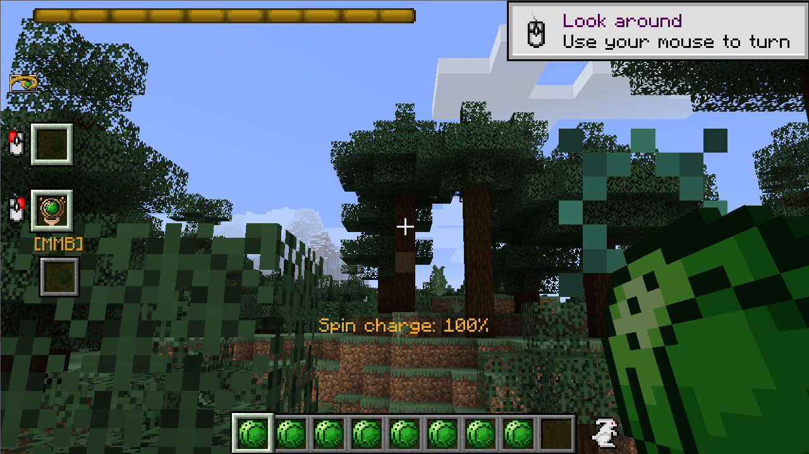
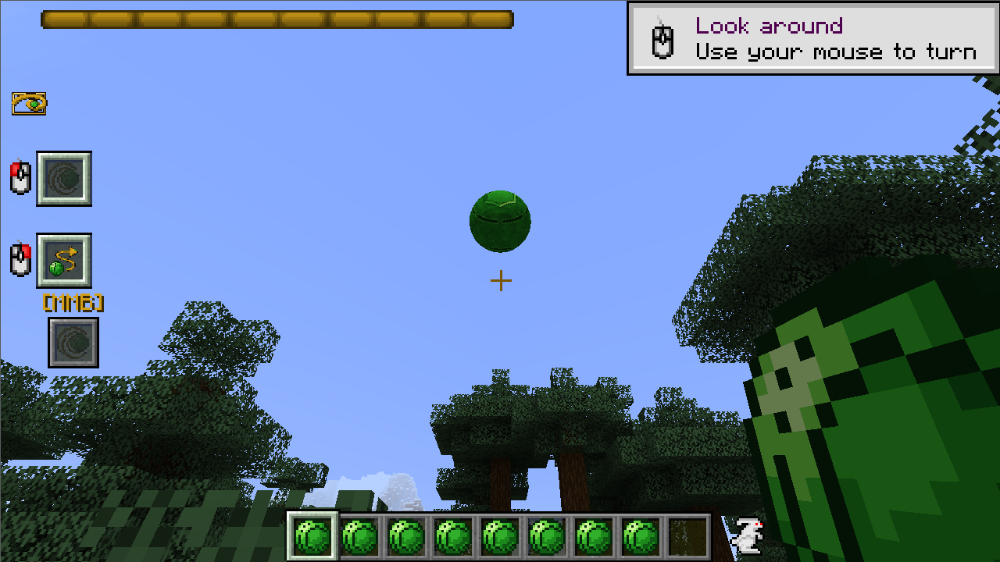
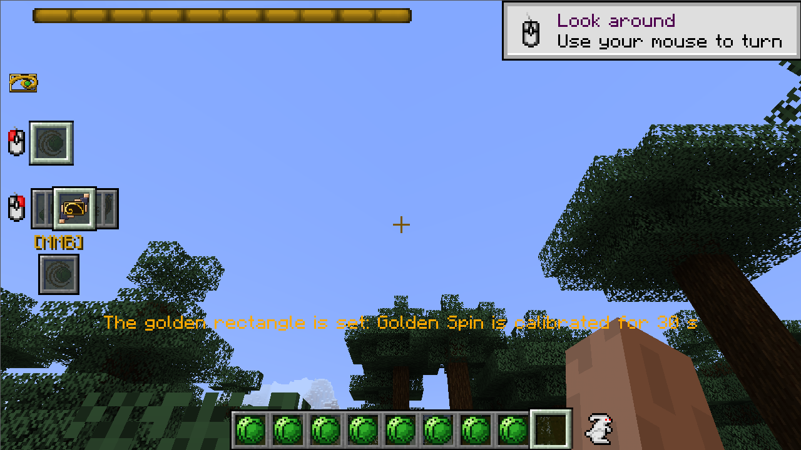

# RotP Spin Addon

> Стальные Шары, Золотой Спин и Ball Breaker из JoJo Частей 7/8 — как кинетика, вращение и Золотое Сечение для [Ripples of the Past](https://github.com/StandoByte/Ripples-of-the-Past).

[](https://github.com/Loischsiy/Rotp-spin-addon/actions/workflows/build.yml)
[](LICENSE)


Здесь Спин — не магия, а геометрия, биомеханика и энергия вращения, так как это есть в манге.
Вы проходите пять уроков Джайро Цеппели по одному, бросаете вращающиеся Стальные Шары, возвращающиеся в руку,
составляете руки в Золотой Прямоугольник, разгоняетесь в Супер Спин — и единожды проявляете **Ball Breaker**.

## Содержание

- [Быстрый старт](#быстрый-старт)
- [Возможности](#возможности)
- [Скриншоты](#скриншоты)
- [Использование](#использование)
- [Конфигурация](#конфигурация)
- [Совместимость](#совместимость)
- [Контрибьютинг](#контрибьютинг)
- [Лицензия](#лицензия)
- [Благодарности](#благодарности)

## Быстрый старт

**Требования:** Minecraft 1.16.5, Forge `36.2.34`, Java 8, Ripples of the Past
(`main_mod_version` в `gradle.properties`, сейчас `1.16.5-0.2.2-snapshot-250108-c`).

```bash
# Проще всего: скачайте jar из последнего запуска GitHub Actions (или Release) и положите в mods/
mods/
├── jojo-1.16.5-....jar   # Ripples of the Past
└── RotP-Spin-1.0.jar      # этот аддон
```

Ваши первые пять минут в игре (читы включены):

```mcfunction
/jojopower give @p rotp_spin:spin
/give @p rotp_spin:steel_ball
/give @p rotp_spin:calibration_buckle
/summon rotp_spin:gyro_teacher ~3 ~ ~3
/spinlesson get @p
```

Бросайте Стальной Шар действием `Spin Ball Throw`, ловите обратно, наносите попадания —
именно эта практика открывает второй урок.

> Собираете из исходников? См. [Контрибьютинг](#контрибьютинг) — JDK 8 обязательна.

## Возможности

**Бросок, зарядка, удар, наведение**

- `Spin Ball Throw` — вращающийся Стальной Шар, наносящий урон, рикошечущий и возвращающийся в руку (или кобуру).
- `Spin Ball Charge` — раскрутите шар в руке перед броском: больше скорость и урон, замедление во время зарядки.
- `Spin Ball Strike` — точечный удар вращающимся шаром, сжатым в руке.
- `Spin Ball Steer` — корректируйте летящий шар в полёте к цели.
- Накрутка Спина на обычные предметы и блоки (`Spin Item/Block Throw`), с трением, веревками и паровым скольжением.

**Пять уроков, добываемых практикой — ✅ каноническая прогрессия**

| Урок | Урок Джайро | Что открывает |
|---|---|---|
| 1 | «Если есть воля — сделай это» | Спин на своём теле: прыжок `Body Brace`, зарядка и удар |
| 2 | «Работай мышцами» | `Muscle Hijack`: наносите попадания шаром, чтобы заставить моб действовать |
| 3 | «Верь во вращение» | Хиджак целей → разблокировка Спина на бросаемых предметах/блоках |
| 4 | Золотой Спин: очертите Золотой Прямоугольник | `Golden Frame` + множитель урона, пробитие барьеров |
| 5 | «Самый короткий путь — обходной» | Супер Спин без галопа; дорога к ACT4/Ball Breaker |

**Золотой Спин и Супер Спин**

- Калибруйтесь по миру: снежинки и природа служат эталоном Золотого; в «мёртвых» биомах нужен `Calibration Buckle` (или собственные руки).
- Здоровая лошадь на естественном галопе порождает бесконечную энергию вращения через стремена — любое препятствие срывает процесс.
- **Сколотый** Стальной Шар заряжается слабее и не удерживает высший Спин. Почините или примите штраф.

**Wrecking Ball и гемипросторная атаксия**

- Сфера гвардии с отделяющимися сателлитами, ранящими с неожиданных углов.
- Даже промах посылает ударную волну: жертва теряет всё **слева** — левая половина экрана затемняется у игроков, мобы не видят целей слева, лошади сбиваются направо.

**Ball Breaker — визуализация энергии Спина**

- Проявляется от броска Супер Спина на галопе — никогда из Стрелы (`NON_ARROW` пул).
- Удар / тяжёлый удар / блок + касание **сенесценции**: каждое касание углубляет старение (потеря макс. HP, скорости и урона за стак), и Стенд жертвы стареет тоже.
- С опциональным аддоном D4C — Золотой бросок пробивает Love Train и достаёт хозяина.

**Снаряжение и учитель**

- `Steel Ball`, `Wrecking Ball`, `Кобура Джайро` (быстрый бросок, ловит возвраты), `Пряжка калибровки`, `Плащ Джайро` (парус Спина).
- `Джайро Цеппели` — бродячий учитель NPC (яйцо призыва `gyro_teacher_egg`) — неаполитанец, который действительно может вас научить.

## Скриншоты

Все кадры сняты в игре без посторонних модов (`mcx`, Forge 1.16.5, llvmpipe).

**Спин в руке, учитель рядом.** Снежный биом служит эталоном Золотого.


**Джайро Цеппели крупно** — фиолетовый пальто, шляпа, светлые волосы. Спавнится в мире и обучает урокам.


**Комплект** — Стальной Шар, Wrecking Ball и Пряжка калибровки в инвентаре.


**Бросок Спина: выпуск и возврат.** Шар покидает руку (пустой первый слот, полоса энергии Спина слева вверху тратится),
летит в воздухе — и возвращается, ведь так работает вращение.


**Ball Breaker в теле.** Зелёный гуманоид с пурпурными деталями ядра,
чёрно-опоясанными конечностями и дождём золотых искр при ударе. В survival проявляется
только от броска Супер Спина на галопе — здесь позан для фото через `/stand give`.


**Продвинутые техники (creative + урок 5).** Ниже — зарядка, наведение и Золотой фрейм, доступные на максимальном уроке.







## Использование

**Обучение и проверка прогресса:**

```mcfunction
/jojopower give @p rotp_spin:spin
/spinlesson get @p
/spinlesson set @p 3
/spinenergy set @p 100
```

**Цикл практики (порядок уроков важен):**

1. Бросайте и бейте Стальным Шаром → счётчик попаданий → урок 2.
2. Хиджакайте мобов уроком 2 → урок 3 (предметы/блоки с Спином).
3. Очерчивайте прямоугольник (`Golden Frame`) у снега/природы, наносите Золотые попадания → урок 4.
4. Ещё Золотые попадания, затем галоп Супер Спина (или обход уроком 5) → урок 5.
5. Бросьте идеальную сферу на полном галопе → проявится Ball Breaker.

**Полезные детали:**

- Возвращённые шары падают в кобуру, если рука занята.
- Лечебный Спин работает как «рентген на воде» над пациентом.
- Обезвоживание (`squeeze`) сплющивает конечности и выжимает воду: Замедление для ног, Слабость для туловища/рук, быстрый голод, гасит огонь, бонус против водных мобов.
- Любое число — урон, дальность, стоимость, кулдаун, радиус, пороги уроков — живёт в конфиге, не в коде.

## Конфигурация

Серверный `ForgeConfigSpec`, никаких хардкодов. Файл: `run/config/rotp_spin-common.toml` (имя может отличаться в сборках).

| Секция | Что настраивает |
|---|---|
| `spin` | пул энергии: макс., реген, стоимости |
| `ball_throw` / `ball_charge` / `ball_strike` / `ball_steer` | урон, скорость, множители зарядки, штраф за сколотый шар, скорость поворота наведения |
| `muscle_hijack` / `healing` / `golden_frame` / `body_brace` | дальность, стан, принудительное действие, скорость лечения, редукция браса, тайминг фрейма |
| `lessons` | пороги попаданий/хиджаков/золотых попаданий для уроков 2–5 |
| `golden_spin` / `super_spin` | множители, скорость галопа, правила помех |
| `wrecking_ball` | сателлиты, длительность атаксии, снос лошади |
| `ball_breaker` | стаки старения, потеря статов, удержание сколотыми |
| `squeeze` | обезвоживание, эффекты конечностей, бонус против водных |
| `compat` | переключатели интеграций Curios / Tusk / D4C |

Полный список ключей с дефолтами: [`SpinConfig.java`](src/main/java/com/loischsiy/rotpspin/config/SpinConfig.java).
Лор за каждой механикой: [`docs/spin-lore.md`](docs/spin-lore.md) — каждая фича помечена ✅ КАНОН / ⚠️ ДОПУЩЕНИЕ / 🔴 OOC (не реализуем).

## Совместимость

- **Обязательно:** Ripples of the Past 1.16.5 (снапшот зафиксирован в `gradle.properties`), Forge `36.2.34`, Java 8.
- **Опционально, отключается автоматически при отсутствии:**
  - `curios` — плащ/кобура в слотах безделушек, поддержка бара энергии;
  - `rotp_t` (аддон Tusk) — заряд бесконечного вращения для Tusk, снимается встречным спином;
  - `rotp_d4c` — Ball Breaker пробивает Love Train.
- Опциональные моды — `compileOnly` + `mandatory=false`, изолированы в `compat.*` — см. [`docs/integrations.md`](docs/integrations.md). Аддон работает полностью автономно.

## Контрибьютинг

Issues и PR приветствуются. Рабочий процесс описан в [`AGENTS.md`](AGENTS.md) — кратко:

```bash
export JAVA_HOME=/usr/lib/jvm/java-8-openjdk-amd64 && export PATH="$JAVA_HOME/bin:$PATH"
java -version   # должно показать 1.8
./gradlew build --offline   # затем:
./gradlew test --offline    # JUnit 5.8.2 + Mockito 4.11.0 (НЕ Mockito 5)
```

Соглашения: официальные маппинги 1.16.5, API RotP `Ability`/`Capability` (без дублирования логики),
никаких хардкодов (конфиг или ничего), никакой лексики «магия/мана» — кинетика, вращение,
микровибрации, Золотое Сечение. Новый предмет/экшен = локали `en_us` + `ru_ru` + иконка.
Conventional Commits, один осмысленный коммит на изменение.

## Лицензия

[GNU GPL v3.0](LICENSE) — как у Ripples of the Past и шаблона аддона. Сохраняйте копирайты при переиспользовании кода.

## Благодарности

- [StandoByte](https://github.com/StandoByte) — Ripples of the Past и шаблон [RotP-Addon-example](https://github.com/StandoByte/RotP-Addon-example), на котором построен этот проект.
- Лор-референсы: [JoJo Wiki — Spin](https://jojowiki.com/Spin), [Steel Ball](https://jojowiki.com/Steel_Ball), [Ball Breaker](https://jojowiki.com/Ball_Breaker), [Tusk](https://jojowiki.com/Tusk), [Gyro Zeppeli](https://jojowiki.com/Gyro_Zeppeli) — номера глав закреплены в `docs/spin-lore.md`.
- Соратники: [Tusk addon](https://github.com/Yarost228/RotpTuskAddon), [Extra Stands](https://github.com/DanielGamer321/Extra-Stands).